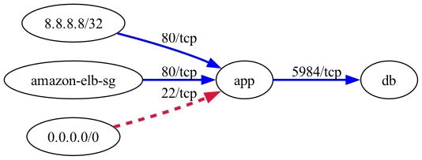

# aws-security-viz

[](https://github.com/anaynayak/aws-security-viz/actions?query=workflow%3ARuby)
[](https://scorecard.dev/viewer/?uri=github.com/anaynayak/aws-security-viz)
[](https://rubygems.org/gems/aws_security_viz)
[](https://github.com/anaynayak/aws-security-viz/pkgs/container/aws-security-viz)
[](https://github.com/anaynayak/aws-security-viz/blob/main/LICENSE.md)

See which security groups can reach which, and which are open to the internet, in one file you can open offline.

aws-security-viz reads the EC2 security group configuration from the AWS API, or from the JSON written by
`aws ec2 describe-security-groups`, and draws it as a graph.

## The HTML viewer


The default output is one HTML page you can open from disk, explore and search, and share.

1. [Collapsed VPCs](outputs.md#html-viewer) keep a large account readable: big graphs open with each VPC as one node.
2. [Can X reach Y](outputs.md#html-viewer) answers from the security group rules, the way AWS evaluates them.
3. [Layouts](outputs.md#html-viewer) include force, traffic flow and exposure rings.
4. [Risky ingress](outputs.md#html-viewer) on a sensitive port is highlighted, and Risky only hides the rest.
5. [Light and dark themes](outputs.md#html-viewer) follow the browser, with a toggle.
6. [One offline file](outputs.md#html-viewer): no server and no CDN.



<div class="grid cards" markdown>

1. **HTML viewer.** The default output, described above. See [Outputs](outputs.md#html-viewer).
2. **Risky ingress highlighting.** `0.0.0.0/0` or `::/0` on a sensitive port is drawn as a dashed crimson edge, and `--fail-on-risk` turns it into a failing exit code. See [Filtering and risk checks](filtering-and-risk-checks.md).
3. **Runs anywhere.** Install the gem, or run the published container image with Ruby and Graphviz built in. See [Installation](installation.md).

</div>

## Try it

```
gem install aws_security_viz
aws_security_viz -o security_groups.json
```

The sample [security_groups.json](assets/security_groups.json) needs no AWS access. The command writes
`aws-security-viz.html`; open it in a browser. The [Quickstart](quickstart.md) covers live AWS access and Docker.

## Where to go next

1. [Quickstart](quickstart.md): first graph from a JSON file, live AWS or Docker.
2. [Configuration](configuration.md): every option, `opts.yml` and exit codes.
3. [Credentials and IAM](credentials-and-iam.md): how credentials are found and the minimal IAM policy.
4. [Security](security.md): what leaves your machine and how to verify a release.

aws-security-viz is MIT licensed. The HTML viewer inlines vendored copies of Cytoscape.js, cytoscape-fcose, cose-base, layout-base, dagre and cytoscape-dagre, which are also MIT licensed; their notices ship inside the gem under `lib/aws_security_viz/vendor/`.
