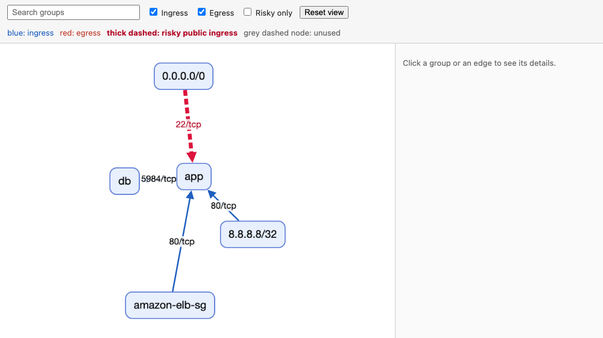
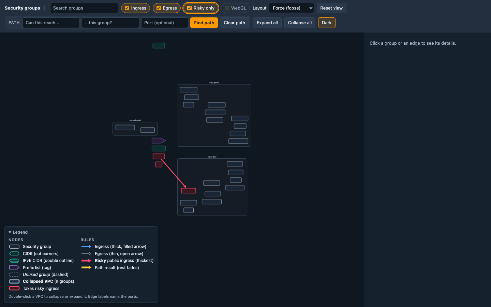
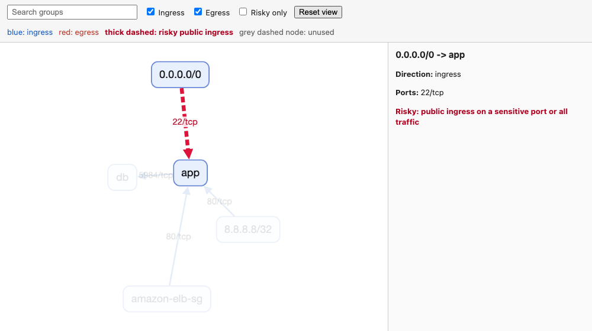
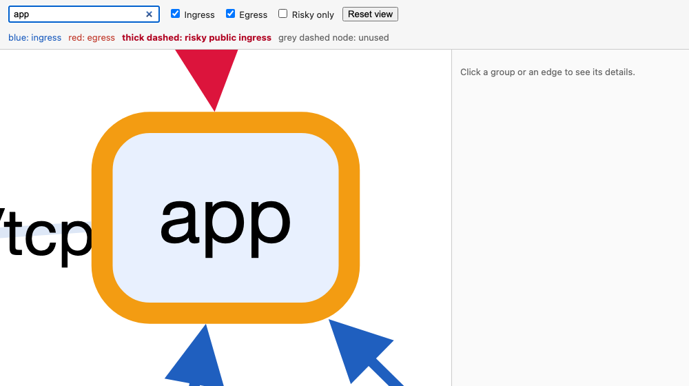

# Outputs

The format follows the extension of `-f/--output`. Without `-f` the tool writes `aws-security-viz.html`. An unknown
extension is rejected with a message listing the supported ones.

| Extension | Format | Needs Graphviz |
| --- | --- | --- |
| `.html`, `.htm` | Self-contained interactive viewer (default) | No |
| `.json` | Nodes and edges as data | No |
| `.mmd` | Mermaid flowchart | No |
| `.dot`, `.gv` | Graphviz DOT text | No |
| `.png`, `.svg`, `.pdf`, `.jpg`, `.jpeg`, `.gif`, `.webp`, `.bmp`, `.tiff`, `.ps`, `.eps` | Rendered image | Yes (`dot` on the path) |

The older `--renderer` flag is deprecated. It still works and prints a warning; use the extension instead.

Edge colours follow the same scheme in every format: blue for ingress, red for egress, and a thick dashed edge for
(crimson in the images, magenta in the HTML viewer) [risky public ingress](filtering-and-risk-checks.md#what-counts-as-risky). With `--show-unused`, groups that no network
interface uses are marked: dashed grey in DOT, an `unused` class in Mermaid, and `unused: true` in JSON and HTML data.
Colour is never the only signal: the viewer legend and the JSON `risky` flag state the same facts in text.

## HTML viewer

`-f out.html` writes one file with Cytoscape.js and the graph data inlined. Open it from disk in a browser; no web
server and no network access are needed.

```
aws_security_viz -o security_groups.json -f viz.html
```



1. Search. Type in the search box to find and centre matching groups.
2. Ingress, Egress and Risky only toggles. Risky only keeps the risky edges and hides the rest.
3. Reset view clears the search and fits the whole graph.
4. Click a group or an edge to see its details. For an edge the panel shows the direction, the ports, any rule
   descriptions, and a risk note.
5. The legend under the toolbar explains the edge styles.
6. Collapsing. Graphs with more than 150 security groups in VPCs (CIDR and other peers are not counted) open with
   every VPC collapsed into one node that shows its group count and how many rules stay inside it. Edges to other
   VPCs and peers are merged into one edge per direction, labelled with the number of rules; its details list the
   ports and rule descriptions. Double-click a VPC to expand or collapse it, or use Expand all and Collapse all. Only
   the VPC you expand is laid out again. Press Enter in the search box to open the VPCs holding a match (a single
   match opens its VPC straight away); clearing the search restores the previous view. Smaller graphs open fully
   expanded.
7. WebGL. When more than 2,000 elements (nodes and edges) are on the canvas, for instance after Expand all on a
   large account, the viewer switches to Cytoscape's experimental WebGL renderer, which draws large graphs much
   faster. The WebGL checkbox in the toolbar switches it on or off at any size; after you use it, the size rule no
   longer changes the renderer. The checkbox is disabled when the browser has no WebGL 2, and the viewer then keeps
   the canvas renderer. The renderer switches on the elements that are showing, so the filter checkboxes can move it too. WebGL does not
   draw dashed edges, so a risky edge is a thick solid line there; risky edges are magenta, thicker than every other
   edge and have a larger arrowhead in both renderers, and the details panel still marks them as risky. If the browser
   takes the WebGL context away, the viewer carries on with the canvas renderer.
8. Can X reach Y. Type a source and a target (a security group, CIDR or other peer, by name or id; the boxes suggest
   matches) and press Enter or Find path. The viewer searches the rules, following their direction, and reports the
   shortest path or that there is none. The path is drawn in orange and the rest dimmed; VPCs on the path that were
   collapsed are opened, and the view is fitted to the path. The details panel lists each hop with its direction,
   ports and rule descriptions. The port box is optional: with a port such as `443`, `443/udp` or `icmp`, only edges
   that allow it are used, so every hop of a path allows that port. Without a port the ports are listed per hop and
   the ports open along the whole path are not computed. The query uses the edges the Ingress, Egress and Risky only
   toggles leave in, and runs again when you change them. Clear path (or Reset view) removes the highlight and puts
   back the collapsed VPCs, zoom and position from before the query.







The page has a Content-Security-Policy and makes no network requests; see [Security](security.md#4-data-handling).

!!! warning
    The output describes your network exposure. Treat the files as sensitive, or use
    [`--obfuscate`](configuration.md#obfuscation) before sharing them.

## Images

Image formats pipe DOT through the `dot` binary, so Graphviz must be installed. The layout engine defaults to `dot`;
change it with `-y/--layout` (`dot`, `neato`, `sfdp`, `fdp`, `twopi`, `circo`) or `:format:` in `opts.yml`.

```
aws_security_viz -o security_groups.json -f viz.svg
aws_security_viz -o security_groups.json -f viz.png --layout neato
```

## JSON

Nodes carry the security group id as `id` and the name as `label`; edges carry `source`, `target`, `label` and, when
risky, `"risky": true`. With several regions each node also carries its region.

```
aws_security_viz -o security_groups.json -f viz.json
```

```json
{"nodes":[{"id":"sg-appgrp","label":"app"},{"id":"0.0.0.0/0","label":"0.0.0.0/0"}],"edges":[{"id":"0.0.0.0/0-sg-appgrp","source":"0.0.0.0/0","target":"sg-appgrp","label":"22/tcp","risky":true}]}
```

The example is shortened to two of the five nodes.

## Mermaid

```
aws_security_viz -o security_groups.json -f viz.mmd
```

```
flowchart LR
  n0["app"]
  n1["8.8.8.8/32"]
  n2["amazon-elb-sg"]
  n3["0.0.0.0/0"]
  n4["db"]
  n0 -->|"5984/tcp"| n4
  n1 -->|"80/tcp"| n0
  n2 -->|"80/tcp"| n0
  n3 -->|"22/tcp"| n0
  linkStyle 0 stroke:#1f5fbf
  linkStyle 1 stroke:#1f5fbf
  linkStyle 2 stroke:#1f5fbf
  linkStyle 3 stroke:#dc143c,stroke-width:4px,stroke-dasharray:6 3
```

Paste the file into a Markdown code fence tagged `mermaid`; GitHub renders it. Mermaid's defaults allow 500 edges and
50,000 characters of text. When the diagram exceeds either, the tool prints a warning and GitHub or `mmdc` may refuse
to render it. Use the HTML viewer for large accounts.

## DOT

`.dot` and `.gv` files are the DOT text itself and need no Graphviz:

```
aws_security_viz -o security_groups.json -f viz.dot
```

```
digraph "G" {
  graph [overlap="false", splines="true", sep="1", concentrate="true", rankdir="LR"];
  "sg-appgrp" [label="app"];
  "0.0.0.0/0" [label="0.0.0.0/0"];
  "0.0.0.0/0" -> "sg-appgrp" [style="dashed", color="crimson", label="22/tcp", penwidth="3"];
}
```

The example is shortened to two of the five nodes.
